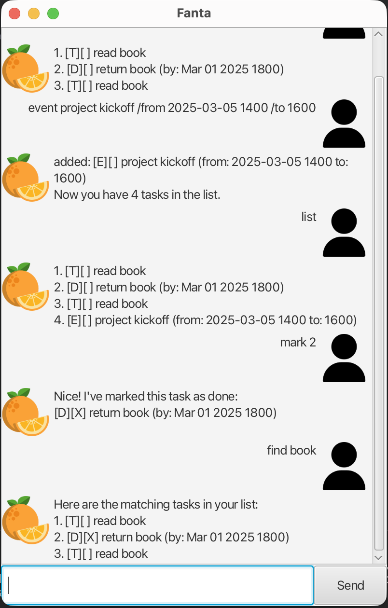

# Fanta User Guide



Fanta is a simple task manager with a friendly GUI. You can add todos, deadlines with dates, events with time ranges, list and search tasks, mark them done, and persist everything automatically to disk.

## Quick Start
1. Install Java 17 or later.
2. Clone this repo and run the app:
   ```bash
   ./gradlew run
   ```
3. Interact through the text box at the bottom of the window. Type a command and press Enter or click **Send**.

Data is saved automatically to `data/fanta.txt` in the project folder.

## Commands
All commands are case-insensitive for the keyword, but task text is kept as typed.

### `todo DESCRIPTION`
Adds a todo.
```
todo read book
```

### `deadline DESCRIPTION /by DATE [TIME]`
Adds a deadline with a date (and optional 24h time).
- Date formats: `yyyy-MM-dd` (e.g., `2025-03-01`)
- DateTime formats: `yyyy-MM-dd HHmm` or `d/M/yyyy HHmm`
```
deadline return book /by 2025-03-01 1800
```

### `event DESCRIPTION /from START /to END`
Adds an event with a time range (free-form text is accepted for start/end).
```
event project kickoff /from 2025-03-05 1400 /to 1600
```

### `list`
Shows all tasks with their numbers and status.

### `mark INDEX` / `unmark INDEX`
Marks or unmarks a task by its number from `list`.
```
mark 2
unmark 2
```

### `delete INDEX`
Deletes the numbered task.
```
delete 3
```

### `find KEYWORD`
Shows tasks whose description contains the keyword (case-insensitive).
```
find book
```

### `bye`
Exits the app (also closes the window).

## Tips
- Use `list` after changes to confirm current ordering.
- Dates are printed in friendly formats, but stored internally in ISO format for reliability.
- If the app cannot read the save file, it will start with an empty list and continue saving new data.
